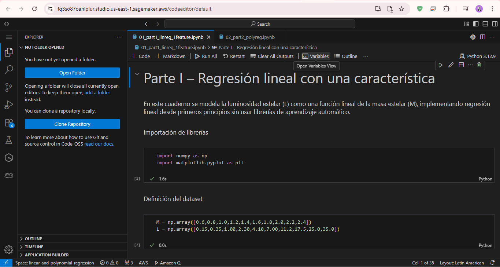
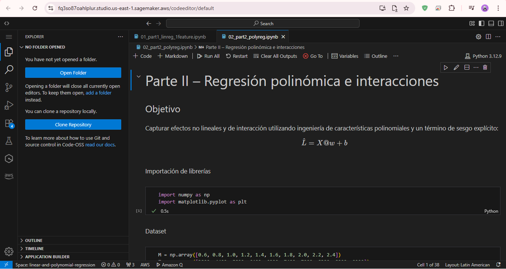
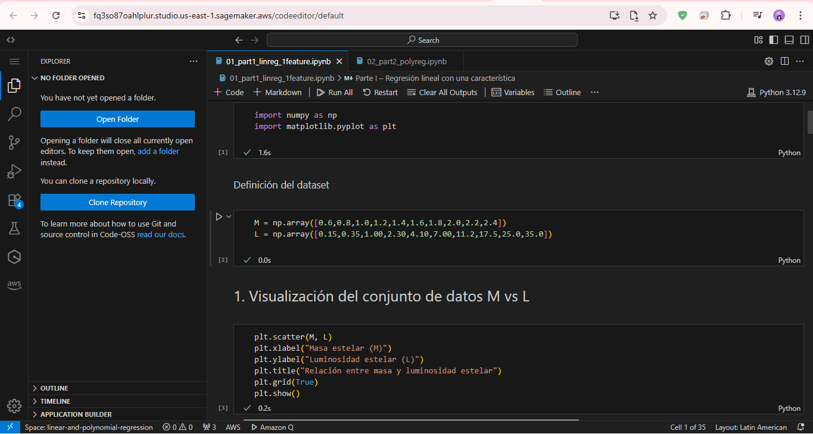
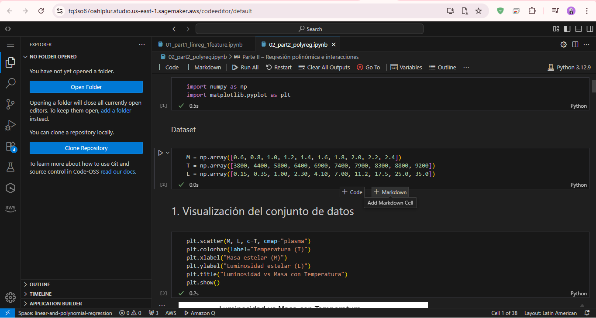
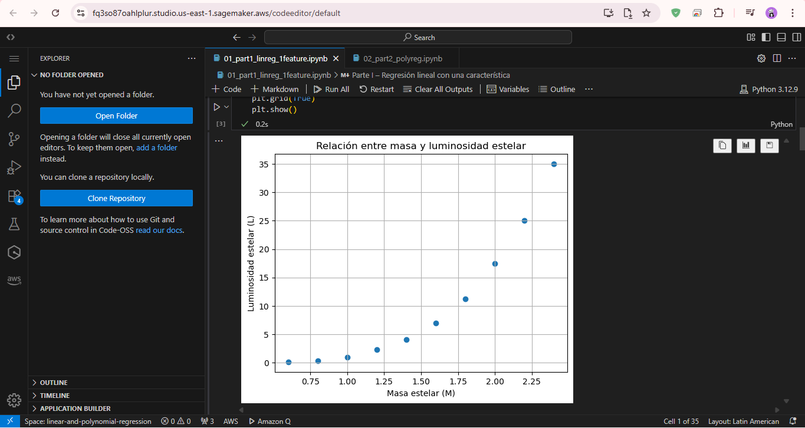
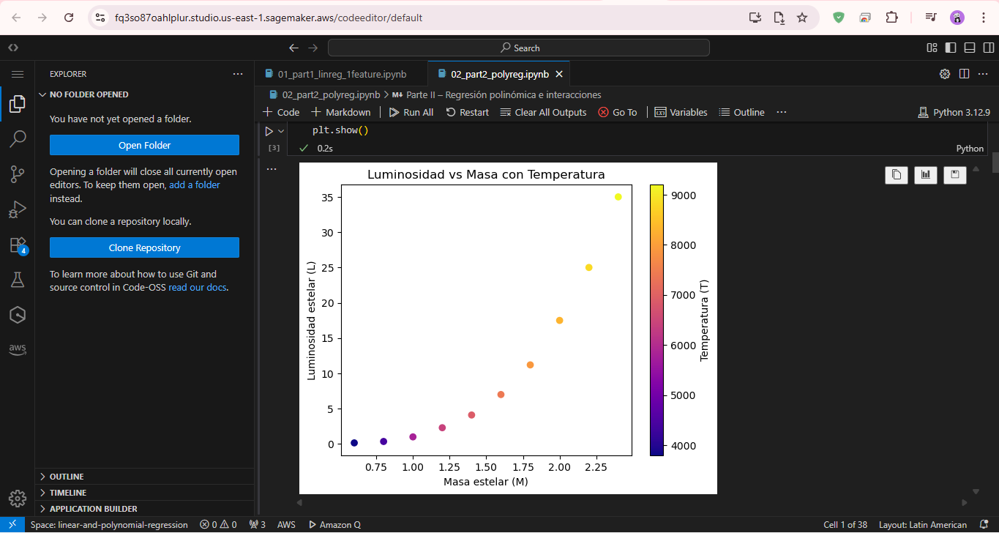

# Luminosidad estelar – Regresión lineal y polinómica

## Descripción
Este repositorio contiene la implementación desde cero de modelos de regresión lineal y polinómica para modelar la luminosidad estelar, utilizando únicamente Python, NumPy y Matplotlib.

## Estructura del repositorio
- 01_part1_linreg_1feature.ipynb
- 02_part2_polyreg.ipynb
- README.md

## Evidencia de ejecución de AWS SageMaker
Primero, se accedió a AWS SageMaker Studio desde el entorno de AWS Academy y se abrió el dominio existente en la región us-east-1.
Luego, se cargaron ambos cuadernos Jupyter en el entorno de trabajo y se seleccionó el kernel Python 3.

Una vez cargados, se ejecutaron todas las celdas de cada cuaderno utilizando la opción Run All Cells.
La ejecución se completó correctamente, sin errores, y los gráficos se visualizaron de forma adecuada directamente en SageMaker.

No se realizó ningún despliegue de modelos, creación de endpoints ni configuraciones adicionales, ya que el objetivo era únicamente validar la correcta ejecución de los cuadernos en la nube.

- Notebooks abiertos

- Ejecución completa

- Gráficos renderizados

### Comparación local vs SageMaker
La ejecución en AWS SageMaker produjo los mismos resultados que la ejecución local.
Los valores aprendidos y los gráficos obtenidos fueron consistentes, sin diferencias significativas, confirmando el correcto funcionamiento de los cuadernos en ambos entornos.